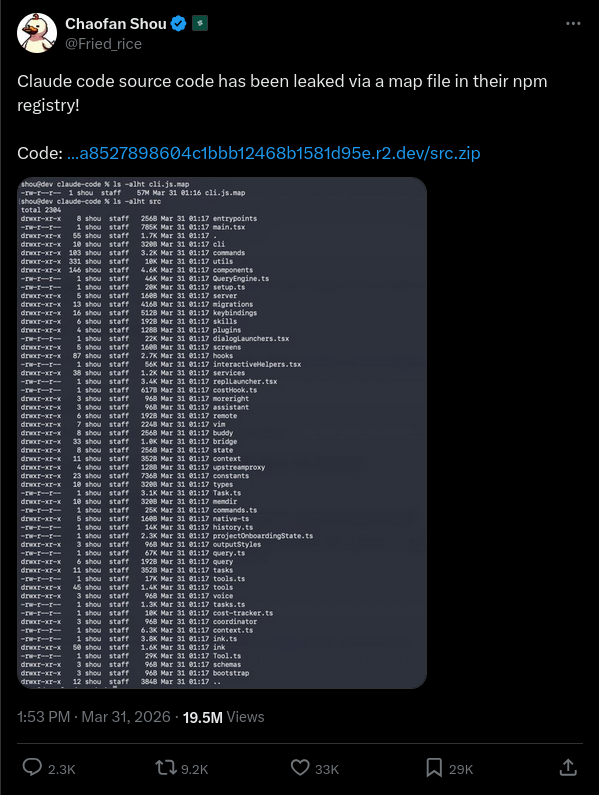
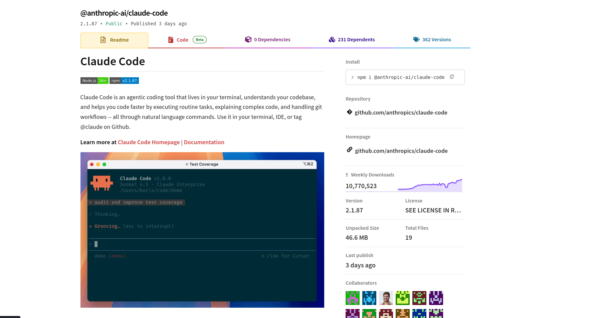

# Claude Code's Entire Source Code Got Leaked via a Sourcemap in npm, Let's Talk About It

> **PS:** This breakdown is also available on [this blog](https://kuber.studio/blog/AI/Claude-Code's-Entire-Source-Code-Got-Leaked-via-a-Sourcemap-in-npm,-Let's-Talk-About-it) with a better reading experience and UX :)

> **Note:** There's a non-zero chance this repo might be taken down. If you want to play around with it later or archive it yourself, feel free to **fork it** and bookmark the external blog link!

---

## ⚠️ Important Disclaimer

**I did not leak these files.** I have simply provided an easy, documented way to access and study this codebase for research purposes. All files and information originate from public findings shared on Twitter/X. All credit for the discovery goes to the original source.

---

Earlier today (March 31st, 2026) - **Chaofan Shou (@Fried_rice)** discovered something that Anthropic probably didn't want the world to see: the **entire source code** of Claude Code, Anthropic's official AI coding CLI, was sitting in plain sight on the npm registry via a sourcemap file bundled into the published package.

[](https://x.com/Fried_rice/status/2038894956459290963)

This repository is a backup of that leaked source, providing a full breakdown of what's in it, how the leak happened, and the internal systems that were never meant to be public.

---

## 🧐 How Did This Even Happen?

When you publish a JavaScript/TypeScript package to npm, the build toolchain often generates **source map files** (`.map` files). These files bridge minified production code and the original source for debugging.

The catch? **Source maps contain the original source code** embedded as strings inside a JSON file under the `sourcesContent` key.

```json
{
  "version": 3,
  "sources": ["../src/main.tsx", "../src/tools/BashTool.ts", "..."],
  "sourcesContent": ["// The ENTIRE original source code of each file", "..."],
  "mappings": "AAAA,SAAS,OAAO..."
}
```

By forgetting to add `*.map` to `.npmignore` or failing to disable source maps in production builds (Bun's default behavior), the entire raw source was shipped to the npm registry.

[](assets/claude-npm-img.png)

---

## 🛠 What's Under the Hood?

Claude Code is not just a simple CLI. It's a massive **785KB `main.tsx`** entry point featuring a custom React terminal renderer (Ink), 40+ tools, and complex multi-agent orchestration.

### 🐣 BUDDY - The Terminal Tamagotchi
Inside [`src/buddy/`](./src/buddy/), there is a full **Tamagotchi-style companion system**.
- **Deterministic Gacha:** Uses a Mulberry32 PRNG seeded from your `userId`.
- **18 Species:** Ranging from Common (*Pebblecrab*) to Legendary (*Nebulynx*).
- **Stats & Souls:** Every buddy has stats like `DEBUGGING`, `CHAOS`, and `SNARK`, with a "soul" description written by Claude.

### 🕵️‍♂️ Undercover Mode - "Do Not Blow Your Cover"
Anthropic employees use Claude Code to contribute to public repos. **Undercover Mode** ([`src/utils/undercover.ts`](./src/utils/undercover.ts)) prevents the AI from leaking internal info:
- Blocks internal model codenames (e.g., *Capybara*, *Tengu*).
- Hides the fact that the user is an AI.
- Confirms that **"Tengu"** is likely the internal codename for Claude Code.

### 🌙 The "Dream" System
Claude Code "dreams" to consolidate memory. The **autoDream** service ([`src/services/autoDream/`](./src/services/autoDream/)) runs as a background subagent to:
1. **Orient:** Read `MEMORY.md`.
2. **Gather:** Find new signals from daily logs.
3. **Consolidate:** Update durable memory files.
4. **Prune:** Keep context efficient.

### 🚀 KAIROS & ULTRAPLAN
- **KAIROS:** An "always-on" proactive assistant that watches logs and acts without waiting for input.
- **ULTRAPLAN:** Offloads complex tasks to a remote **Opus 4.6** session for up to 30 minutes of deep planning.

---

## 📂 Architecture & Directory Structure

```text
src/
├── main.tsx                 # CLI Entrypoint (Commander.js + React/Ink)
├── QueryEngine.ts           # Core LLM logic
├── Tool.ts                  # Base tool definitions
├── tools/                   # 40+ Agent tools (Bash, Files, LSP, Web)
├── services/                # Backend (MCP, OAuth, Analytics, Dreams)
├── coordinator/             # Multi-agent orchestration (Swarm)
├── bridge/                  # IDE Integration layer
└── buddy/                   # The secret Tamagotchi system
```

---

## ⚙️ How to Use & Explore

### 📦 Prerequisites
- **[Bun Runtime](https://bun.sh)** (Highly Recommended) or Node.js v18+
- **TypeScript** installed globally

### 🚀 Getting Started

1.  **Clone the repository:**
    ```bash
    git clone https://github.com/your-username/claude-leaked.git
    cd claude-leaked
    ```

2.  **Install Dependencies:**
    ```bash
    npm install
    ```

3.  **Build the Project:**
    ```bash
    npm run build
    ```

4.  **Run the CLI:**
    ```bash
    node dist/main.js
    ```

### 🔍 Explore with MCP
This repo includes an **MCP Server** to let you explore the source using Claude itself:
```bash
claude mcp add code-explorer -- npx -y claude-code-explorer-mcp
```

---

## 📈 SEO & Rankings
**Keywords:** `Claude Code Leak`, `Anthropic Source Code`, `AI Agent Framework`, `Claude 3.5 Sonnet CLI`, `Tengu Anthropic`, `npm sourcemap leak`, `Open Source AI Agent`.

---

## 📜 Credits & Legal

- **Discovery:** [Chaofan Shou (@Fried_rice)](https://x.com/Fried_rice)
- **Source Post:** [Twitter/X Announcement](https://x.com/Fried_rice/status/2038894956459290963)
- **Author of this Mirror:** [Yasas Banu](https://www.yasasbanuka.tech)

**Disclaimer:** All original source code is the proprietary property of **Anthropic PBC**. This repository is for educational and archival purposes only. **This is not an official Anthropic product.**

---

### 📩 Contact
For spamming reasons the email has been removed. 
